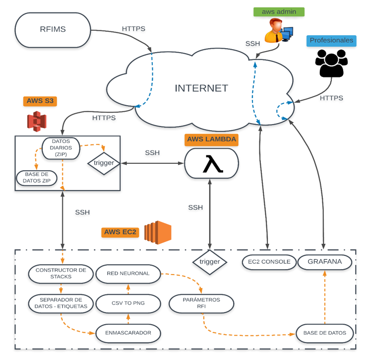
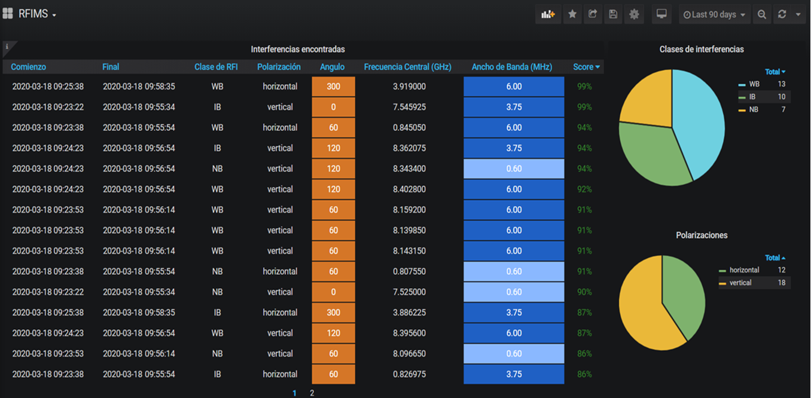

# RFI Detection and Classification with Mask-RCNN
This software is capable of detecting and classifying radio frecuency interference, present in spectrograms. The software uses the Mask RCNN framework (https://github.com/matterport/Mask_RCNN) to do the RFI detection and clasification, and AWS EC2 servers for storage and processing. This project was developed to assist the Chineese-argentinian Radio Telescope (CART)  (http://cart.unsj.edu.ar/proyecto.php) located in San Juan - Argentina.

Specifically, this software detects every RFI present in the spectrogram and classify them as Narrow Band (NB), Intermediate Band (IB) or Wide Band (WB) according to their band width. This system, is a very useful tool for those professionals in charge of preventing the CART to damage because of powerful RFI, present in the location. Besides of detection and clasification, the software provides more data, like polarization, maximum power detected, azimuthal angle, central frecuency, bandwidth and delimitation in time of the RFI.

Devolped by Dario Quinteros and Leandro Saldivar.

# Results

# System Architecture

# Visualization with Grafana

